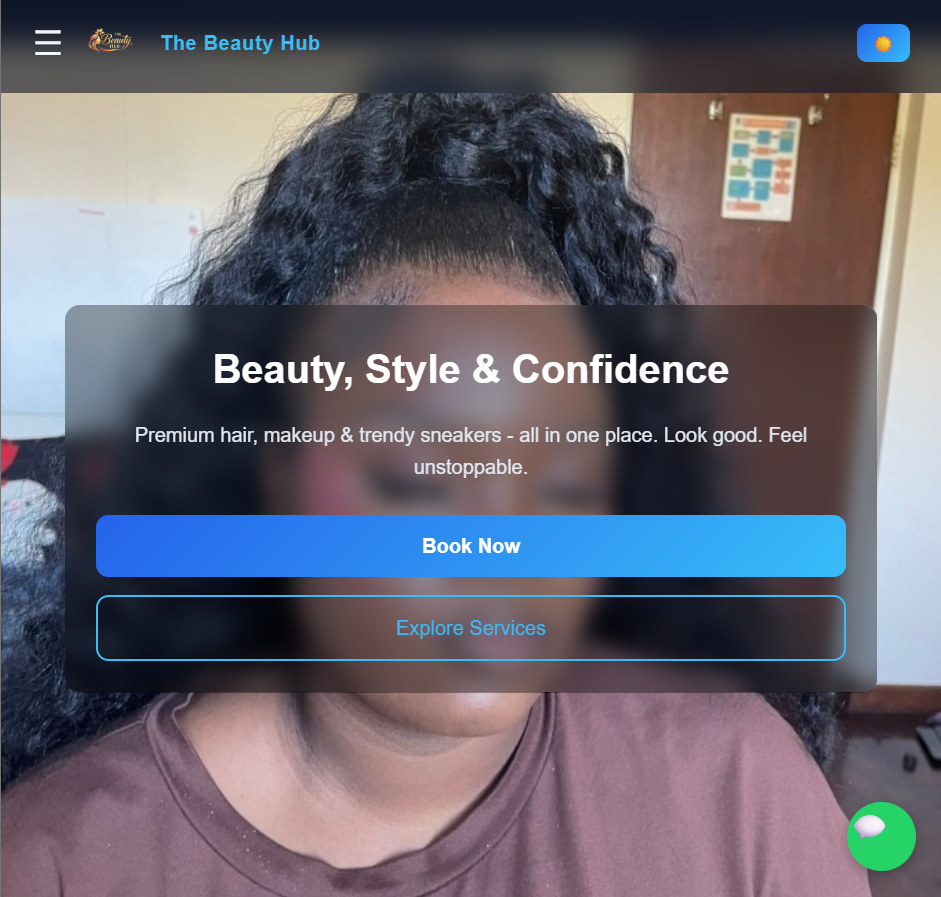
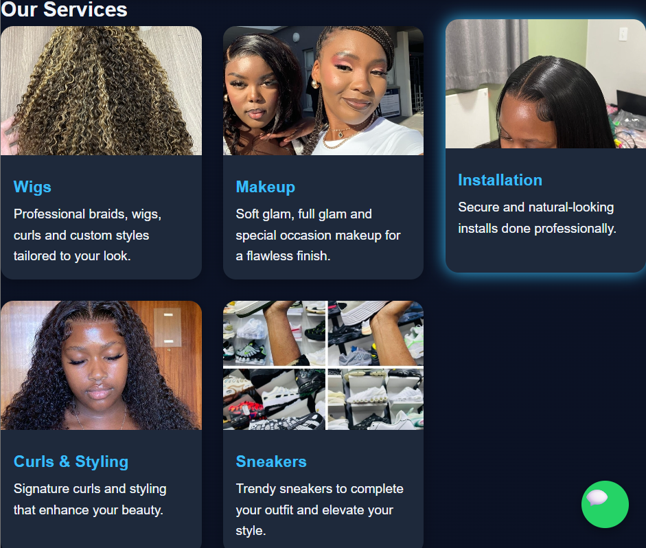
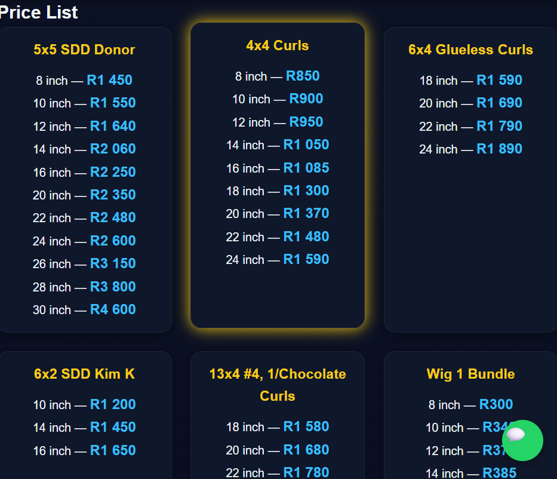
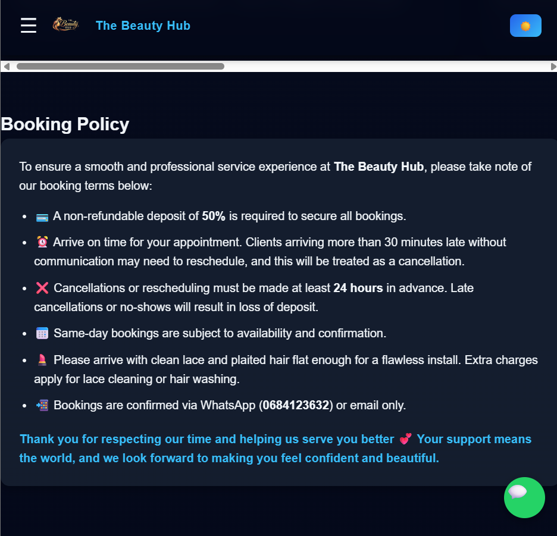

---

# 💇‍♀️ The Beauty Hub – Salon Website

## 📖 Project Overview
The Beauty Hub website is a fully designed and developed modern salon and lifestyle business website built as part of a full-stack web development internship task.

This project was created for a real local business owned by a friend, which offers a combination of beauty services such as hair styling, makeup, wig installations, and also sells trendy sneakers. The goal of the website is to help the business establish a strong online presence, improve customer trust, and make it easier for clients to view services, prices, and make bookings.


The website focuses on:
- Clean modern UI design
- Mobile responsiveness
- Smooth navigation and UX
- Service and price clarity
- WhatsApp + email integration
- Backend contact form system

The backend is built using Node.js and Express, enabling real email delivery with formatted HTML messages and auto-replies.

---

## 🚀 Live Demo
👉 https://de-bongz.github.io/FUTURE_FS_03/

---

## 🚀 Features

### 🎨 Design & UX
- Clean, modern UI with immersive hero section
- Mobile‑first responsiveness
- Dark/light mode toggle
- Smooth navigation and user experience

### 💇‍♀️ Services & Content
- Services showcase (hair, makeup, wigs, sneakers)
- Dynamic price list
- Gallery of work
- Client testimonials
- Booking policy section

### 📲 Communication
- WhatsApp floating button for instant chat
- Contact form with backend email delivery (Nodemailer)
- Automated replies for inquiries

---

## 🛠️ Tech Stack

### Frontend
- HTML  
- CSS  
- JavaScript  

### Backend
- Node.js  
- Express.js  
- Nodemailer  
- dotenv  
- cors  

---

## 📸 Screenshots





---

## 📁 Project Structure

---

## ⚙️ Setup Instructions

### 1. Clone Project
```bash
git clone https://github.com/De-Bongz/FUTURE_FS_03.git
cd the-beauty-hub
```
### 2.Install Dependencies
```bash
npm install
```
### 3.Setup Environment Variables
Create a ```.env ``` file:
```Env
EMAIL_USER=your-email@example.com
EMAIL_PASS=your-email-password
```
### 4. Start Backend Server
```
npm start
```

server runs on:
```
http://localhost:3000
```
---
## 🔌 API Endpoints

### Contact form

-```POST/contact``` → sends email via Nodemailer

### 🧪 Testing
- Manual testing across desktop and mobile devices
- Verified responsiveness with Chrome DevTools
- Backend email tested with Gmail + Outlook accounts

### 🧪 Future Improvements
- Online booking system with calendar integration
- Admin dashboard for managing services and prices
- Role‑based access control (Admin/Staff)
- Customer accounts with booking history

---
## 👨‍💻 Developer
Built by: Bongani Maluleke 
Computer Science Student – University of the Western Cape (UWC) 
Purpose: Internship Task + Real business project

---
